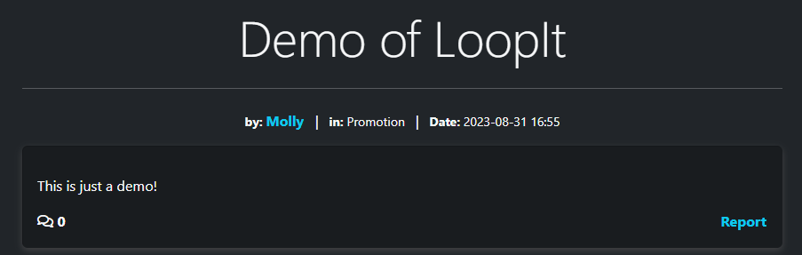
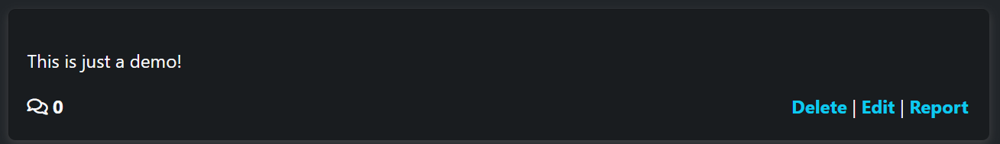
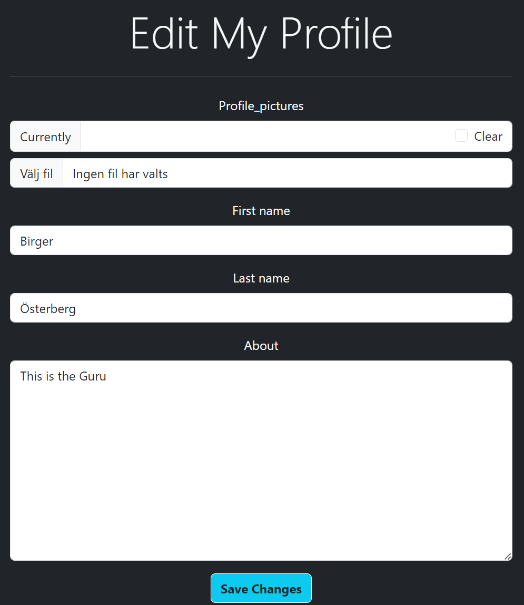

# Loopit - A Community for Loopers

 \
[LoopIt Live page link](https://loopit-561b13093461.herokuapp.com/)

Loopit is an online community designed for enthusiasts of a special unique art of music creation, where looping machines like the famous BOSS RC505 are often used. This Django-based web application provides a platform for musicians to collaborate, share tips and tutorials, and discuss their love for this unique art form.

## Agile Planning and Development Process

The development of Loopit followed an Agile methodology, utilizing a Kanban board hosted on GitHub to manage tasks and workflows. This approach made it easier to focus on immediate tasks while also keeping an eye on the broader project goals and progress.

### Kanban Board

[Link to the board](https://github.com/users/birgerosterberg/projects/1/views/1)

The board was divided into three primary columns:

- **Todo**: Tasks that are planned but not yet in progress.
- **In Progress**: Tasks currently being worked on.
- **Done**: Tasks that have been completed.

Each task was created as an issue and then categorized into Epics and User Stories for better organization and focus.

### Epics and User Stories

Prior to starting development, Epics and User Stories were created to define the scope and goals of the project. This made it easier to break down the project into smaller, manageable chunks and helped in tracking progress effectively.

- **Epics**: Large areas of work that contain multiple tasks.
- **User Stories**: Smaller tasks that contribute to the completion of an Epic.

This Agile planning setup contributed significantly to the efficient and focused development of Loopit.

### Base Setup:

**Epic 1: Base Setup** \
**Description: The base setup epic is for all stories needed for the base set up of the application. Without the base setup, the app would not be possible, so it was the first epic to be delivered as all other features depend on the completion of the base setup.**

User Stories: \
As a developer, I need to create the base.html page and structure so that other pages can reuse the layout \
As a developer, I need to create static resources so that images, css and javascript work on the website \
As a developer, I need to set up the project so that it is ready for implementing the core features \
As a developer, I need to create the footer with social media links and contact information \
As a developer, I need to create the navbar so that users can navigate the website from any device

### User Management:

**Epic 2: User Registration and Authentication** \
**Description: Develop user registration and authentication functionalities to allow users to create accounts, log in, log out, and reset passwords.**

User Stories: \
As a new user, I want to create an account so that I can start using the LoopIt. \
As a registered user, I want to be able to log in and log out of my account. \
X As a registered user, I want to reset my password if I forget it.

**Epic 3: User Profile and Settings** \
**Description: Implement user profiles where users can view their activity, customize display names, and upload profile pictures.**

User Stories: \
X As a user, I want to have a profile page where I can see my posts and likes. \
As a user, I want to customize my display name and profile picture.

### Content Management:

**Epic 4: Post Creation and Management** \
**Description: Build the functionality to manage posts, including creating, editing, and deleting posts, as well as viewing a list of posts.**

User Stories: \
As a user, I want to view a list of posts shared by other loop artists. \
As a user, I want to create a new post to share my own content, including the ability to add a YouTube video or post an image. \
As a user, I want to edit my own posts if I need to update the content. \
As a user, I want to delete my own posts if I decide to remove them.

**Epic 5: Interaction (Liking, Commenting, Rating and Reporting)** \
**Description: Enable users to interact with posts by liking, commenting, reporting and rating them.**

User Stories: \
X As a user, I want to like posts that I find interesting to show appreciation for the content. \
As a user, I want to comment on posts to engage with the community and share my thoughts. \
X As a user, I want to rate posts using a heart-based system to express my opinion about the quality of the content. \
As a user, I want to report a post if I find it inappropriate, offensive, or violating the community guidelines. \
As a user, I want to report a comment that I believe is inappropriate or offensive.

### Deployment and Documentation:

**Epic 6: Deployment and Hosting** \
**Description: Prepare your application for deployment and choose a hosting platform to make it accessible online.**

User Stories: \
As a developer, I want to configure production settings for my Django application. \
As a developer, I want to set up a production-ready database (e.g., PostgreSQL) for my application. \
As a developer, I want to deploy my Django application to Heroku. \
As a user, I want to access the LoopIt online through a secure URL. \
As a user, I want the deployed application to handle traffic efficiently and reliably.

**Epic 7: Documentation** \
**Description: Create comprehensive documentation to guide users and other developers in using and contributing to your project.**

User Stories: \
As a developer, I want to provide a README file with setup instructions for local development. \
As a developer, I want to document the application's features, including how to create an account, post content, and interact with posts. \
As a developer, I want to explain the structure of the project, including its models, views, and templates. \
As a developer, I want to document any third-party libraries used in the project.

## Site Goals

1. **Create a Safe Space for Creativity**: To provide an environment where loopers can share their work without fear of harsh judgement or copyright infringement.
2. **Foster Collaboration**: To facilitate connections between musicians for potential collaborations and creative exploration.
3. **Knowledge Sharing**: To become a repository of tutorials, guides, and other educational resources related to loop-based music.
4. **Expand the Community**: To introduce more people to the joy and creative possibilities of loop-based music.
5. **Event Promotion**: To be the go-to platform for discovering and promoting events related to this genre of music.

## Project Scope

### Scope

The scope of Loopit was carefully defined to create a focused and user-friendly platform. Key elements include:

- Providing a community space specifically geared towards loop-based music enthusiasts.
- Offering functionalities that support collaboration, sharing, and learning.
- Ensuring a secure and safe environment for all users to freely express themselves and share content.

---

## Features

### Navigation Bar

The navigation bar is dynamic and tailored to provide the most relevant options based on a user's authentication status and permissions. Below are the different types of navigation bars that a user may encounter:

#### For Non-Logged-In Users

 \
For visitors who have not logged in, the navigation bar offers the essentials:

- **Home**: Navigate back to the main page.
- **Register**: Sign up for a new Loopit account.
- **Login**: Access your existing Loopit account.

#### For Logged-In Users

Once logged in, users will see additional options that enhance their ability to interact with the Loopit community:

- **Home**: Navigate back to the main page.
- **Logout**: Sign out of your Loopit account.
- **My Profile**: View and edit your personal profile.

#### For Superusers

For users with admin privileges, the navigation bar provides the highest level of control:

- **Home**: Navigate back to the main page.
- **Logout**: Sign out of your Loopit account.
- **My Profile**: View and edit your personal profile.
- **Admin**: Access the admin panel to manage users, posts, and more.

Each set of options is deliberately minimal and self-explanatory with extra visuals by using icons, sticking with the overall design philosophy of Loopit—simple, functional, and user-centric.

---

## Categories

Categories are a key feature of Loopit, designed to help users easily navigate and discover content that interests them.

### How it Works

When you land on the main page, the default setting displays posts from all categories. The categories are listed in their own navigation bar, and each serves as a filter:

- **All**: Shows posts from all categories. This is the default view when the page loads.
- **General**: Shows posts only from 'General'.
- **Hardware**: Shows posts only from 'Hardware'.
- **Software**: Shows posts only from 'Software'.
- ... (and so on for other categories)

### Active Category Highlight

When you click on a category, the background color of that category changes to gray to indicate that it is the active filter. This visual cue helps you instantly recognize what content you're currently viewing.

### User Experience

The category system streamlines user experience by allowing quick and effortless content filtering. Just click a category, and the page will automatically update to show posts that match your selection.

The goal is to help you find what you're looking for with minimal effort, aligning with Loopit's overarching design philosophy of simplicity and functionality.

---

## Create Post

For logged-in users, the "Create Post" button is a crucial part of the Loopit experience and serves as the primary call-to-action on the platform.

### Design and Placement

Designed with an elegant aesthetic, this button stands out without being overwhelming. Its design cues make it clear that creating a post is an important action on this platform. The button is strategically placed for maximum visibility and easy access, encouraging users to share their content.

### Availability

The "Create Post" button is only available to users who are logged in, emphasizing its role as a feature for community members.

### User Experience

Clicking the button takes you to a simple and intuitive form that makes post creation a breeze. This is aligned with Loopit's core design philosophy of making user interactions as seamless as possible.

### Post Creation Experience

Creating a post on Loopit is designed to be a fluid and enriching experience, thanks to the feature-rich SummerNote widget for the content section and the essential category selection. Here's what you can expect:

#### Title

The first field you'll encounter is the title. A compelling title can capture the essence of your post and attract more viewers.

#### Content

For the content, I've integrated the powerful SummerNote widget. It provides an array of options, from simple text formatting to adding images, links, and even code snippets. This allows you to customize your post exactly the way you want it, enhancing both the creation and consumption experience.

#### Categories

Before publishing, you'll need to select a category for your post. This helps in placing your post within the relevant topic, making it easier for community members to find and engage with your content.

#### Create Post Button

Finally, there's the 'Create' button. A simple click, and your post goes live, sharing your content with the Loopit community.

This intuitive and straightforward process reflects Loopit's commitment to creating an environment where anyone can easily contribute and share their expertise or interests.

---

## Post Display

The Post display on Loopit is designed to give you all the essential information you need at a glance, while keeping the layout simple and uncluttered.

### Layout and Information

#### Title

The first thing you'll notice is the title of the post, prominently displayed to capture your attention and give you an idea of what the post is about.

#### Author and Category

Underneath the title on the left-hand side, you'll find the author's name followed by the category the post belongs to. This arrangement helps you quickly gauge the topic and the credibility of the post.

#### Date, Time, and Comments

On the right-hand side of the title, the date and time the post was created are displayed. Just next to it, you'll see an icon accompanied by a number indicating the total number of comments on the post. This provides a snapshot of the level of engagement the post has received.

#### User Experience

By placing everything you need to know in an organized, easy-to-read format, Loopit aims to make content discovery both efficient and pleasant.

#### Hover Effect

To further enhance user interaction, a subtle hover effect has been implemented on each post display. When you hover over a post, the opacity changes to indicate that it's clickable. This visual cue adds to the platform's overall user-friendly design by making navigation more intuitive.

---

## Post View Page

## Individual Post View Page

Once you click on a post from the homepage, you are taken to the individual 'Post View' page, where you can delve deeper into the content and its details.

### Layout and Components

#### Title and Information View

At the top, you are greeted with the title of the post, immediately followed by an information section. This section provides details like the Author's name, the Category the post falls under, and the Time and Date when the post was made.

#### Content Container

As you scroll down, you'll find the 'Content Container,' which houses the meat of the post. This could be text, images, and even embedded YouTube videos, providing a rich and engaging experience.

#### Comment Counter

In the bottom corner of the 'Content Container,' there's a comment count display, giving you an idea of the post's engagement level.

### Conditional Features

Depending on who is viewing the post, additional options are made available:

- **General Users**: For visitors without an account, no additional options are shown.
  

- **Logged-In Users**: If you are logged in, a 'Report' link appears, allowing you to report inappropriate content.
  
- **Post Author**: If you are the author of the post, 'Edit' and 'Delete' options become available, offering full control over your content.
  

---

## Comment Section

Engaging with posts goes beyond just viewing them. The Comment Section offers users an opportunity to share their thoughts, ask questions, or simply engage with the community.

### Comment Display

#### Author, Date, and Time

Each comment clearly displays the Author's name, as well as the Date and Time when the comment was posted. This provides context and credibility to each comment.

#### Report Link for Logged-In Users

For logged-in users, a 'Report' link is available next to each comment, allowing for the reporting of inappropriate or offensive content.

#### Comment Content

Following the author and timestamp information, the actual content of the comment is displayed, facilitating meaningful discussions and interactions.

### Commenting Interface

The interface for posting a comment is designed to be as straightforward as possible:

#### Account Display

Before you type, the username you are logged into is displayed, so you can ensure you're commenting from the correct account, especially if you manage multiple profiles such as an artist account and a private user account.

#### Text Field and Submit Button

To comment, all you need to do is type your thoughts into a generously sized text field and hit the 'Submit' button. It's that simple.

By keeping the comment section user-friendly and intuitive, Loopit continues to foster a community where everyone feels comfortable to express themselves.

---

## User Profiles

Loopit offers personalized user profiles to enhance community engagement and provide a space for individual expression.

### Accessing Profiles

You can navigate to a user's profile in several ways:

- **Author Names**: Clicking on the author names in post or comment sections will direct you to that user's profile.
- **My Profile Link**: Logged-in users can easily access their own profile by clicking the 'My Profile' link in the navigation bar.

### Profile Components

#### Public Profile

When you land on a user's profile, you'll find the following:

- **Profile Picture**: A profile image of the user, which adds a personal touch.
- **First and Last Name**: User's identified name to know who you are interacting with.
- **About**: A section where users can write a little something about themselves, further fostering a sense of community.

#### Personal Profile

When viewing your own profile, additional options are available:

- **Edit Profile Button**: This button takes you to a form where you can:
  - Add or change your profile picture.
  - Modify your first and last name.
  - Update or add text to your 'About' section.

By providing these features, Loopit aims to create a platform where users can feel recognized and engaged, amplifying the sense of community.

---

## Pagination

Loopit offers a simple yet effective pagination system to help users navigate through the growing library of posts efficiently.

### How It Works

- **Next Button**: Once there are more than 10 posts displayed on the front page, a 'Next' button will appear at the bottom of the post list. Clicking this will take you to the next set of posts.

!

- **Previous Button**: When you're on subsequent pages, a 'Previous' button will also appear beside the 'Next' button. Clicking 'Previous' takes you back to the prior set of posts.

This intuitive pagination setup ensures that users can easily explore more content without feeling overwhelmed by a seemingly endless scroll of posts.

## Testing

[Link to separate testing readme](https://github.com/birgerosterberg/loopit/blob/main/TESTING.md)

### Summary of Test Scenarios

#### Test Scenario 1: Navbar Visibility and Functionality

- **Brief Description**: Verifies if the navigation bar items are properly displayed and function as expected for different user roles.
- **Note**: Essential for navigating the site; passed all tests.

#### Test Scenario 2: "Create Post" Button Visibility

- **Brief Description**: Checks if the 'Create Post' button is visible for logged-in and superusers but not for guests.
- **Note**: Post creation access control tested; all conditions met.

#### Test Scenario 3: "Create Post" Page Accessibility and Functionality

- **Brief Description**: Validates the form fields for creating a post and confirms if they are mandatory.
- **Note**: Ensures only qualified users can post; all tests passed.

#### Test Scenario 4: Category Filter Functionality

- **Brief Description**: Tests if posts can be filtered based on categories.
- **Note**: Makes browsing easier; categories work as expected.

#### Test Scenario 5: Viewing Individual Post Pages

- **Brief Description**: Examines what each type of user can see when viewing a post.
- **Note**: Tailored user experiences; worked as intended.

#### Test Scenario 6: Testing the "Report" Functionality

- **Brief Description**: Verifies if posts and comments can be reported by logged-in users.
- **Note**: Key for community moderation; functionality verified.

#### Test Scenario 7: Admin/Superuser Viewing Reports

- **Brief Description**: Ensures an admin can view reports made by users.
- **Note**: Important for site moderation; tests passed.

#### Test Scenario 8: Edit and Delete Posts

- **Brief Description**: Confirms if post authors can edit and delete their posts.
- **Note**: Author controls verified; all tests passed.

#### Test Scenario 9: Create a Comment

- **Brief Description**: Validates if logged-in users can create comments on posts.
- **Note**: Enhances user interaction; functioned as expected.

#### Test Scenario 10: Account Creation (Registration)

- **Brief Description**: Tests the user registration form and its various input validations.
- **Note**: Account creation validation tests all passed.

#### Test Scenario 11: Logout Functionality

- **Brief Description**: Confirms if users can log out successfully.
- **Note**: Logout procedure validated; tests successful.

#### Test Scenario 12: Login Functionality

- **Brief Description**: Validates if users can log in successfully.
- **Note**: Access control tests passed; login functional.

#### Test Scenario 13: Profile Viewing and Editing Functionality

- **Brief Description**: Tests if users can view and edit their profiles.
- **Note**: Personalization tests successful; profile pages validated.

#### Test Scenario 14: Author Name Link to Profile

- **Brief Description**: Verifies if clicking the author's name takes you to their profile.
- **Note**: Enhances social features; worked as expected.

#### Test Scenario 15: Admin Panel Functionality

- **Brief Description**: Validates if the admin panel works as expected.
- **Note**: Essential for site management; all functionalities work.

#### Test Scenario 16: Responsiveness of the Page

- **Brief Description**: Tests the site's responsiveness in general.
- **Note**: Accessibility validated; all tests passed.

#### Test Scenario 17: Responsiveness on Different Devices

- **Brief Description**: Tests the site's responsiveness on different devices and browsers.
- **Note**: Accessibility on multiple devices confirmed; all tests passed.

[Link to separate testing readme](https://github.com/birgerosterberg/loopit/blob/main/TESTING.md)

## Technical Features

### Responsive Design

Loopit was built with a responsive design to ensure an optimal user experience across a variety of devices, including desktops, tablets, and smartphones.

### CRUD on Posts

The platform allows for full CRUD (Create, Read, Update, Delete) operations on user-generated posts. This enables users to freely share their insights, ask questions, and interact with the community.

### Simple Easy Design

Ease of use was a primary consideration during the design phase. Loopit features a clean, intuitive interface that lets users navigate the site with minimal effort.

## Database Design

The database consists of several tables, each representing a different aspect of the Loopit platform. Below is a schema overview:

### Tables

1. **User** (Inherited from Django's built-in User model)

   - id (Auto-generated)
   - username
   - password
   - email
   - ...

2. **Report**

   - id (Auto-generated)
   - reporter (Foreign Key -> User)
   - content_type (Foreign Key -> ContentType)
   - object_id (PositiveIntegerField)
   - reported_item (GenericForeignKey)
   - reason (CharField, max_length=200)
   - timestamp (DateTimeField, auto_now_add=True)

3. **Category**

   - id (Auto-generated)
   - name (CharField, max_length=100)
   - description (TextField)

4. **Post**

   - id (Auto-generated)
   - title (CharField, max_length=200)
   - slug (AutoSlugField, unique=True)
   - author (Foreign Key -> User)
   - category (Foreign Key -> Category)
   - content (TextField)
   - image (CloudinaryField)
   - created_on (DateTimeField, auto_now_add=True)
   - reports (GenericRelation -> Report)

5. **Comment**

   - id (Auto-generated)
   - post (Foreign Key -> Post)
   - author (Foreign Key -> User)
   - body (TextField)
   - created_on (DateTimeField, auto_now_add=True)
   - upvibes (ManyToManyField -> User)
   - reports (GenericRelation -> Report)

6. **UserProfile**

   - id (Auto-generated)
   - user (OneToOneField -> User)
   - profile_picture (CloudinaryField, blank=True)
   - first_name (CharField, max_length=100, blank=True)
   - last_name (CharField, max_length=100, blank=True)
   - about (TextField, blank=True)

### Relationships

- A `User` can have multiple `Posts` but each `Post` belongs to one `User`.
- A `Post` can belong to one `Category`.
- A `User` can have multiple `Reports` but each `Report` is created by one `User`.
- A `User` can have multiple `Comments` but each `Comment` is created by one `User`.
- A `User` has one `UserProfile`.
- A `Post` can have multiple `Comments` but each `Comment` belongs to one `Post`.

## Design Philosophy

As the sole developer behind Loopit, my design philosophy centers around minimalism and a user-focused approach. I wanted to create a space where users feel at ease and can focus on what matters most—loop-based music.

### Color Scheme

I chose a dark background (`bg-dark`) coupled with light text (`text-light`) to achieve a high-contrast, visually appealing design that is also easy on the eyes.

### Framework

I opted for Bootstrap as my go-to framework. It simplified the development process, letting me concentrate more on features and less on layout issues. Plus, Bootstrap comes with a plethora of built-in components that are both functional and aesthetic.

### Minimalistic Approach

Minimalism was always at the forefront of my mind while designing this platform. My goal was to include only what's absolutely necessary for users, eliminating any elements that could distract or confuse. This 'less is more' philosophy has shaped Loopit into a platform that's simple but efficient, devoid of any unnecessary bells and whistles.

## Wireframes

 \
 \

## Technologies Used

### Frontend / Backend

- **HTML**:
  - The structure of the Website was developed using HTML as the main language.
- **CSS**:
  - The Website was styled using custom CSS in an external file.
- **JavaScript**:
  - Used to manipulate the DOM.
- **Bootstrap**:
  - Used throughout the site for responsiveness, layout, and predefined style elements.
- **Font Awesome**:
  - Used for various icons throughout the site.
- **Favicon.io**:
  - Favicon files were created at [Favicon.io Converter](https://favicon.io/favicon-converter/).
- **Python**:
  - The main programming language used for the application.
- **Django**:
  - Python web framework used for building the application.
- **Cloudinary**:
  - A cloud storage solution for website media and other static files. It also allows for the manipulation and optimization of media delivery.

### Version Control and Deployment

- **Git**:
  - Used to commit and push code during the development of the Website.
- **GitHub**:
  - Source code is hosted on GitHub.
- **Heroku**:
  - Used for live website deployment.

### Design and Planning

- **Balsamiq**:
  - Wireframes were created using Balsamiq from [Balsamiq Website](https://balsamiq.com/wireframes/desktop/).

## Deployment

### Version Control

1. **The Site**

- The Site was created using VSCode workspace and pushed to GitHub.

2. **Adding Files to Staging**

- Run `git add .` to add files to the staging area.

3. **Committing Changes**

- Run `git commit -m "commit message"` to commit changes to the local repository.

4. **Pushing Changes**

- Run `git push` to push committed code to GitHub.

### Heroku Deployment

#### Requirement and Procfile

1. **Creating `requirements.txt`**

- Run `pip3 freeze --local > requirements.txt` to generate the `requirements.txt` file.

2. **Creating Procfile**

- Create a `Procfile` with the line `web: gunicorn loopit.wsgi`.

#### Creating Heroku App

1. **Log into Heroku**

- Go to the Heroku Dashboard.

2. **Create a New App**

- Click "New" and select "Create new app".

3. **Naming and Region**

- Name your app and select the closest region.

### Creating a Database

1. **Log into ElephantSQL**

- Log into ElephantSQL.com and access your dashboard.

2. **Create New Instance**

- Click "Create New Instance".

3. **Setting up Plan and Region**

- Set up a plan, name it, and select the closest data center.

4. **Final Steps**

- Click "Review" and "Create instance".

5. **Copy Database URL**

- Return to the ElephantSQL dashboard and copy the database URL.

### The `env.py` File

1. **Create `env.py`**

- Create an `env.py` file and ensure it's in `.gitignore`.

2. **Add Environment Variables**

- Add `DATABASE_URL` and `SECRET_KEY` to `env.py`.

3. **Cloudinary (Optional)**

- If using Cloudinary, add `CLOUDINARY_URL` to `env.py`.

### Setting Environment Variables in Heroku

1. **Access Heroku Dashboard**

- Go to "Settings" in the Heroku Dashboard.

2. **Reveal Config Vars**

- Click "Reveal Config Vars".

3. **Add Config Vars**

- Add `DATABASE_URL` and `SECRET_KEY`. Optionally, add `CLOUDINARY_URL` and `PORT`.

### Connecting to GitHub and Deploy

1. **Select Deployment Method**

- On the Heroku Dashboard, go to "Deploy" and select GitHub.

2. **Connect to GitHub**

- Search for the project repository and click "Connect".

3. **Enable Automatic Deploys**

- Optionally, enable automatic deploys.

4. **Deploy Branch**

- Click "Deploy Branch".

### Forking the Repository

1. **Locate Repository**

- Log into GitHub and locate the repository.

2. **Fork Repository**

- Click the "Fork" button.

### Making a Local Clone

1. **Locate Repository on GitHub**

- Log into GitHub and find the repository.

2. **Copy Repository URL**

- Click the 'Code' dropdown and copy the URL.

3. **Open Git Bash**

- Open Git Bash in your IDE.

4. **Clone Repository**

- Run `git clone <URL>`.

5. **Install Requirements**

- Run `pip install -r requirements.txt` to install the necessary packages.

## Credits:

https://www.pngegg.com/en/png-zepmn - Infinity symbol default.jpg
