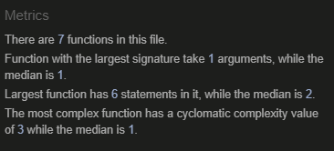

# Manual Testing Documentation for LoopIt

## Test Scenarios

### Test Scenario 1: Navbar Visibility and Functionality

#### User Roles:

- Non-logged-in User
- Logged-in User
- Superuser

#### Test Description:

Test the Navbar to ensure that it displays the correct options based on the user's role and that each option redirects to the appropriate page.

#### Test Steps and Results:

| User Type          | Test Steps                           | Expected Results                                         | Actual Results       | Status                                  |
| ------------------ | ------------------------------------ | -------------------------------------------------------- | -------------------- | --------------------------------------- |
| Non-logged-in User | 1. View the page without logging in. | Only "Home", "Login", and "Register" are visible.        | Behaved as expected. | Passed |
|                    | 2. Click "Home".                     | Should redirect to the homepage.                         | Behaved as expected. | Passed |
|                    | 3. Click "Login".                    | Should redirect to the login page.                       | Behaved as expected. | Passed |
|                    | 4. Click "Register".                 | Should redirect to the registration page.                | Behaved as expected. | Passed |
| Logged-in User     | 1. Log in as a regular user.         | "Home", "Logout", and "My Profile" are visible.          | Behaved as expected. | Passed |
|                    | 2. Click "Home".                     | Should redirect to the homepage.                         | Behaved as expected. | Passed |
|                    | 3. Click "Logout".                   | Should log out and redirect to the homepage.             | Behaved as expected. | Passed |
|                    | 4. Click "My Profile".               | Should redirect to the user's profile page.              | Behaved as expected. | Passed |
| Superuser          | 1. Log in as a Superuser.            | "Home", "Logout", "My Profile", and "Admin" are visible. | Behaved as expected. | Passed |
|                    | 2. Click "Home".                     | Should redirect to the homepage.                         | Behaved as expected. | Passed |
|                    | 3. Click "Logout".                   | Should log out and redirect to the homepage.             | Behaved as expected. | Passed |
|                    | 4. Click "My Profile".               | Should redirect to the user's profile page.              | Behaved as expected. | Passed |
|                    | 5. Click "Admin".                    | Should redirect to the admin dashboard.                  | Behaved as expected. | Passed |

---

### Test Scenario 2: "Create Post" Button Visibility

#### User Roles:

- Non-logged-in User
- Logged-in User
- Superuser

#### Test Description:

Test to ensure that the "Create Post" button is visible only for Logged-in Users and Superusers, and not visible for Non-logged-in Users.

#### Test Steps and Results:

| User Type          | Test Steps                           | Expected Results                            | Actual Results       | Status                                  |
| ------------------ | ------------------------------------ | ------------------------------------------- | -------------------- | --------------------------------------- |
| Non-logged-in User | 1. View the page without logging in. | "Create Post" button should not be visible. | Behaved as expected. | Passed |
| Logged-in User     | 1. Log in as a regular user.         | "Create Post" button should be visible.     | Behaved as expected. | Passed |
|                    | 2. Click "Create Post".              | Should redirect to the "Create Post" page.  | Behaved as expected. | Passed |
| Superuser          | 1. Log in as a Superuser.            | "Create Post" button should be visible.     | Behaved as expected. | Passed |
|                    | 2. Click "Create Post".              | Should redirect to the "Create Post" page.  | Behaved as expected. | Passed |

---

### Test Scenario 3: "Create Post" Page Accessibility and Functionality

#### User Roles:

- Non-logged-in User
- Logged-in User
- Superuser

#### Test Description:

To test if the "Create Post" page is only accessible by Logged-in Users and Superusers. Also, to ensure that all fields (Title, Content, Category) are mandatory for creating a post.

#### Test Steps and Results:

| User Type          | Test Steps                                               | Expected Results                                      | Actual Results       | Status                                  |
| ------------------ | -------------------------------------------------------- | ----------------------------------------------------- | -------------------- | --------------------------------------- |
| Non-logged-in User | 1. Attempt to navigate to `/url/create_post/`.           | Should be redirected to the login page.               | Behaved as expected. | Passed |
| Logged-in User     | 1. Log in as a regular user.                             | Should be able to navigate to the "Create Post" page. | Behaved as expected. | Passed |
|                    | 2. Fill in only Title, leave Content and Category blank. | Should not be able to create the post.                | Behaved as expected. | Passed |
|                    | 3. Fill in only Content, leave Title and Category blank. | Should not be able to create the post.                | Behaved as expected. | Passed |
|                    | 4. Fill in only Category, leave Title and Content blank. | Should not be able to create the post.                | Behaved as expected. | Passed |
|                    | 5. Fill in all fields (Title, Content, Category).        | Should be able to create a post.                      | Behaved as expected. | Passed |
| Superuser          | 1. Log in as a Superuser.                                | Should be able to navigate to the "Create Post" page. | Behaved as expected. | Passed |
|                    | 2. Fill in only Title, leave Content and Category blank. | Should not be able to create the post.                | Behaved as expected. | Passed |
|                    | 3. Fill in only Content, leave Title and Category blank. | Should not be able to create the post.                | Behaved as expected. | Passed |
|                    | 4. Fill in only Category, leave Title and Content blank. | Should not be able to create the post.                | Behaved as expected. | Passed |
|                    | 5. Fill in all fields (Title, Content, Category).        | Should be able to create a post.                      | Behaved as expected. | Passed |

---

### Test Scenario 4: Category Filter Functionality

#### User Roles:

- All Users

#### Test Description:

To test if selecting a category filters the posts accordingly and highlights the selected category. The available categories are All, General, Hardware, Software, Promotion, Inspiration.

#### Test Steps and Results:

| User Type | Test Steps                                       | Expected Results                                                                                  | Actual Results       | Status                                  |
| --------- | ------------------------------------------------ | ------------------------------------------------------------------------------------------------- | -------------------- | --------------------------------------- |
| All Users | 1. Select "All" from the categories row.         | All posts should be displayed. "All" should be marked as active.                                  | Behaved as expected. | Passed |
|           | 2. Select "General" from the categories row.     | Only posts tagged as "General" should be displayed. "General" should be marked as active.         | Behaved as expected. | Passed |
|           | 3. Select "Hardware" from the categories row.    | Only posts tagged as "Hardware" should be displayed. "Hardware" should be marked as active.       | Behaved as expected. | Passed |
|           | 4. Select "Software" from the categories row.    | Only posts tagged as "Software" should be displayed. "Software" should be marked as active.       | Behaved as expected. | Passed |
|           | 5. Select "Promotion" from the categories row.   | Only posts tagged as "Promotion" should be displayed. "Promotion" should be marked as active.     | Behaved as expected. | Passed |
|           | 6. Select "Inspiration" from the categories row. | Only posts tagged as "Inspiration" should be displayed. "Inspiration" should be marked as active. | Behaved as expected. | Passed |

---

### Test Scenario 5: Viewing Individual Post Pages

#### User Roles:

- Author (User who owns the post)
- Logged-in User (not the author)
- Non-logged-in User

#### Test Description:

To test the different viewing options and buttons available on individual post pages based on the user role.

#### Test Steps and Results:

| User Type          | Test Steps                                                  | Expected Results                                                                                                                            | Actual Results       | Status                                  |
| ------------------ | ----------------------------------------------------------- | ------------------------------------------------------------------------------------------------------------------------------------------- | -------------------- | --------------------------------------- |
| Author             | 1. Log in and navigate to a post you authored.              | Should see the post along with Edit and Delete options. Should also see the "Report" button on the post, and the "Create a Comment" fields. | Behaved as expected. | Passed |
|                    |                                                             |                                                                                                                                             |                      |                                         |
| Logged-in User     | 1. Log in as a different user (not the author of the post). | Should see the post, the "Report" button on the post, and the "Create a Comment" fields.                                                    | Behaved as expected. | Passed |
|                    |                                                             |                                                                                                                                             |                      |                                         |
| Non-logged-in User | 1. View the post without logging in.                        | Should see the post and the comments made on it. No "Report" button or "Create a Comment" fields visible.                                   | Behaved as expected. | Passed |

---

### Test Scenario 6: Testing the "Report" Functionality

#### User Roles:

- Logged-in User
- Non-logged-in User

#### Test Description:

To test if the "Report" function can be used by a Logged-in User to report a post or a comment. Also to test if a Non-logged-in User can access the URL for reporting.

#### Test Steps and Results:

| User Type          | Test Steps                                                                           | Expected Results                                       | Actual Results       | Status                                  |
| ------------------ | ------------------------------------------------------------------------------------ | ------------------------------------------------------ | -------------------- | --------------------------------------- |
| Logged-in User     | 1. Log in and navigate to a post or comment.                                         | Should see the "Report" button on the post or comment. | Behaved as expected. | Passed |
|                    | 2. Click the "Report" button on the post or comment.                                 | Should be able to report the post or comment.          | Behaved as expected. | Passed |
| Non-logged-in User | 1. Try to directly access the URL for the "Report" functionality without logging in. | Should be redirected to the login page.                | Behaved as expected. | Passed |

---

### Test Scenario 7: Admin/Superuser Viewing Reports

#### User Roles:

- Admin / Superuser

#### Test Description:

To test if the Admin or Superuser can view reports made on posts or comments after they have been reported.

#### Test Steps and Results:

| User Type       | Test Steps                                                                            | Expected Results                                               | Actual Results       | Status                                  |
| --------------- | ------------------------------------------------------------------------------------- | -------------------------------------------------------------- | -------------------- | --------------------------------------- |
| Admin/Superuser | 1. Log in as Admin or Superuser and navigate to the section where reports are listed. | Should be able to see the list of reported posts and comments. | Behaved as expected. | Passed |

---

### Test Scenario 8: Edit and Delete Posts

#### User Roles:

- Author (User who owns the post)
- Non-logged-in User
- Non-author Logged-in User

#### Test Description:

To test the edit and delete functionalities of posts, making sure they are restricted based on user roles and function as designed.

#### Test Steps and Results:

| User Type                 | Test Steps                                                                               | Expected Results                                                                                                  | Actual Results       | Status                                  |
| ------------------------- | ---------------------------------------------------------------------------------------- | ----------------------------------------------------------------------------------------------------------------- | -------------------- | --------------------------------------- |
| Author                    | 1. Log in and navigate to a post you authored.                                           | Should see the "Edit" and "Delete" options.                                                                       | Behaved as expected. | Passed |
|                           | 2. Click on the "Edit" button and make changes.                                          | Should be directed to the Edit page, and upon making changes and submitting, redirected back to the updated post. | Behaved as expected. | Passed |
|                           | 3. Click on the "Delete" button.                                                         | Should be directed to a confirmation page asking to confirm the delete action.                                    | Behaved as expected. | Passed |
|                           | 4. Confirm the delete action.                                                            | Should be redirected to the front page with a "Post has been deleted" message.                                    | Behaved as expected. | Passed |
| Non-logged-in User        | 1. Navigate to a post without logging in.                                                | Should not see "Edit" and "Delete" options.                                                                       | Behaved as expected. | Passed |
|                           | 2. Try to directly access the Edit/Delete URL for that specific post without logging in. | Should be redirected to the login page.                                                                           | Behaved as expected. | Passed |
| Non-author Logged-in User | 1. Log in and navigate to a post you did not author.                                     | Should not see "Edit" and "Delete" options.                                                                       | Behaved as expected. | Passed |
|                           | 2. Try to directly access the Edit/Delete URL for that specific post while logged in.    | Should not be able to edit or delete the post. Should be redirected or see an unauthorized message.               | Behaved as expected. | Passed |

---

### Test Scenario 9: Create a Comment

#### User Roles:

- Logged-in User
- Non-logged-in User

#### Test Description:

To test the functionality of creating a comment on a post as a logged-in user.

#### Test Steps and Results:

| User Type          | Test Steps                                                  | Expected Results                                                                                                              | Actual Results       | Status                                  |
| ------------------ | ----------------------------------------------------------- | ----------------------------------------------------------------------------------------------------------------------------- | -------------------- | --------------------------------------- |
| Logged-in User     | 1. Log in and navigate to a post.                           | Should see a comment field with a "Submit" button.                                                                            | Behaved as expected. | Passed |
|                    | 2. Write something in the comment field and click "Submit". | Comment should be created, username should be displayed along with time and date. Comment count on post should increase by 1. | Behaved as expected. | Passed |
| Non-logged-in User | 1. Navigate to a post without logging in.                   | Should not see the comment field or "Submit" button.                                                                          | Behaved as expected. | Passed |

---

### Test Scenario 10: Account Creation (Registration)

#### User Roles:

- Non-logged-in User

#### Test Description:

To test the functionality of account creation via the Signup page.

#### Test Steps and Results:

| User Type          | Test Steps                                                                                                                                        | Expected Results                                                                                                   | Actual Results       | Status                                  |
| ------------------ | ------------------------------------------------------------------------------------------------------------------------------------------------- | ------------------------------------------------------------------------------------------------------------------ | -------------------- | --------------------------------------- |
| Non-logged-in User | 1. Navigate to the Signup page by clicking the "Register" button.                                                                                 | Should be taken to the Signup page, with fields for username, optional email, password, and password confirmation. | Behaved as expected. | Passed |
|                    | 2. Enter an improperly formatted email (e.g., "wrongemail.com") and click the "Sign Up" button.                                                   | Should see an error message indicating that the email format is incorrect.                                         | Behaved as expected. | Passed |
|                    | 3. Enter a non-unique username and click the "Sign Up" button.                                                                                    | Should see an error message stating that the username needs to be unique.                                          | Behaved as expected. | Passed |
|                    | 4. Enter a weak password and click the "Sign Up" button.                                                                                          | Should see an error message about the password not being strong enough.                                            | Behaved as expected. | Passed |
|                    | 5. Enter differing passwords in the "Password" and "Repeat Password" fields, then click the "Sign Up" button.                                     | Should see an error message stating that the passwords do not match.                                               | Behaved as expected. | Passed |
|                    | 6. Fill in all fields correctly with a properly formatted email, unique username, and matching strong passwords, then click the "Sign Up" button. | Should successfully create the account and be redirected to the frontpage.                                         | Behaved as expected. | Passed |

---

### Test Scenario 11: Logout Functionality

#### User Roles:

- Logged-in User
- Superuser

#### Test Description:

To test the functionality of logging out from the application.

#### Test Steps and Results:

| User Type      | Test Steps                                             | Expected Results                                                                                                 | Actual Results       | Status                                  |
| -------------- | ------------------------------------------------------ | ---------------------------------------------------------------------------------------------------------------- | -------------------- | --------------------------------------- |
| Logged-in User | 1. Click the "Logout" button from the Navbar.          | Should be directed to a page that asks for logout confirmation.                                                  | Behaved as expected. | Passed |
|                | 2. Confirm the logout action on the confirmation page. | Should be logged out and redirected to the front page with a message stating "You have successfully logged out." | Behaved as expected. | Passed |
| Superuser      | 1. Click the "Logout" button from the Navbar.          | Should be directed to a page that asks for logout confirmation.                                                  | Behaved as expected. | Passed |
|                | 2. Confirm the logout action on the confirmation page. | Should be logged out and redirected to the front page with a message stating "You have successfully logged out." | Behaved as expected. | Passed |

---

### Test Scenario 12: Login Functionality

#### User Roles:

- Non-logged-in User

#### Test Description:

To test the login functionality of the application.

#### Test Steps and Results:

| User Type          | Test Steps                                                                  | Expected Results                                                                                                                          | Actual Results       | Status                                  |
| ------------------ | --------------------------------------------------------------------------- | ----------------------------------------------------------------------------------------------------------------------------------------- | -------------------- | --------------------------------------- |
| Non-logged-in User | 1. Click the "Login" button from the Navbar.                                | Should be redirected to the login page where username and password fields are displayed.                                                  | Behaved as expected. | Passed |
|                    | 2. Enter incorrect username and/or password, then click the "Login" button. | Should see an error message indicating incorrect username and/or password.                                                                | Behaved as expected. | Passed |
|                    | 3. Enter correct username and password, then click the "Login" button.      | Should be redirected to the front page with a message stating "You have successfully logged in."                                          | Behaved as expected. | Passed |
|                    | 4. Check the Navbar after successful login.                                 | The Navbar should now show options according to the user role, like "Logout" and "My Profile". If Superuser also show the "Admin" option. | Behaved as expected. | Passed |

---

### Test Scenario 13: Profile Viewing and Editing Functionality

#### User Roles:

- Logged-in User
- Non-logged-in User

#### Test Description:

To test the profile viewing and editing functionalities.

#### Test Steps and Results:

| User Type          | Test Steps                                                                        | Expected Results                                                                                                        | Actual Results       | Status                                  |
| ------------------ | --------------------------------------------------------------------------------- | ----------------------------------------------------------------------------------------------------------------------- | -------------------- | --------------------------------------- |
| Logged-in User     | 1. Click the "My Profile" button from the Navbar.                                 | Should be redirected to own profile page with an option to edit profile.                                                | Behaved as expected. | Passed |
|                    | 2. Click "Edit Profile" on the profile page.                                      | Should be taken to the edit profile page with options to change profile picture, first name, last name, and about info. | Behaved as expected. | Passed |
|                    | 3. Make changes and click "Submit."                                               | Should be redirected back to the profile page, showing the new changes.                                                 | Behaved as expected. | Passed |
| Non-logged-in User | 4. Try to access `/profile` directly via URL.                                     | Should be redirected to the login page.                                                                                 | Behaved as expected. | Passed |
|                    | 5. Try to access another user's profile via `/profile/username` directly via URL. | Should be able to view the profile (as this feature is intended to be public).                                          | Behaved as expected. | Passed |
|                    | 6. Try to access `/profile/edit` directly via URL.                                | Should be redirected to the login page.                                                                                 | Behaved as expected. | Passed |

---

### Test Scenario 14: Author Name Link to Profile

#### User Roles:

- All Users

#### Test Description:

To test whether clicking the author's username in a post or a comment directs the user to the author's profile page.

#### Test Steps and Results:

| User Type      | Test Steps                                                | Expected Results                                 | Actual Results       | Status                                  |
| -------------- | --------------------------------------------------------- | ------------------------------------------------ | -------------------- | --------------------------------------- |
| None Logged In | 1. Click on the author's username in a post or a comment. | Should be directed to the author's profile page. | Behaved as expected. | Passed |
| Logged In User | 1. Click on the author's username in a post or a comment. | Should be directed to the author's profile page. | Behaved as expected. | Passed |
| Superuser      | 1. Click on the author's username in a post or a comment. | Should be directed to the author's profile page. | Behaved as expected. | Passed |

---

### Test Scenario 15: Admin Panel Functionality

#### User Roles:

- Superuser

#### Test Description:

To test the various functionalities available in the Admin Panel for Superusers.

#### Test Steps and Results:

| User Type | Test Steps                                              | Expected Results                                                                                                    | Actual Results       | Status                                  |
| --------- | ------------------------------------------------------- | ------------------------------------------------------------------------------------------------------------------- | -------------------- | --------------------------------------- |
| Superuser | 1. Access the Admin Panel from the Navbar.              | Should be redirected to the Admin Panel interface.                                                                  | Behaved as expected. | Passed |
|           | 2. Navigate to 'Users' section.                         | Should be able to see a list of registered users and have the ability to change their rights to Superuser or Staff. | Behaved as expected. | Passed |
|           | 3. Navigate to 'Categories' section.                    | Should be able to see existing categories and add new ones.                                                         | Behaved as expected. | Passed |
|           | 4. Navigate to 'Reports' section.                       | Should be able to see reports and remove them.                                                                      | Behaved as expected. | Passed |
|           | 5. Navigate to 'Comments/Posts' section.                | Should be able to delete items.                                                                                     | Behaved as expected. | Passed |
|           | 6. Navigate to 'User Profiles' section.                 | Should be able to edit user profiles.                                                                               | Behaved as expected. | Passed |
|           | 7. Navigate to 'Posts' section within 'Comments/Posts'. | Should be able to edit posts.                                                                                       | Behaved as expected. | Passed |

---

### Test Scenario 16: Responsiveness of the Page

#### User Roles:

- All Users

#### Test Description:

To test the responsiveness of the website down to 320px width, ensuring that all elements scale and function properly on smaller screens. This includes navbar functionality, form elements, buttons, and textual content.

#### Test Steps and Results:

| Page/Feature         | Test Steps                           | Expected Results                                    | Actual Results       | Status                                  |
| -------------------- | ------------------------------------ | --------------------------------------------------- | -------------------- | --------------------------------------- |
| Navbar               | 1. Scale the browser to 320px width. | Navbar should scale and remain functional.          | Behaved as expected. | Passed |
| Frontpage/View Posts | 1. Scale the browser to 320px width. | Posts should be fully visible and functional.       | Behaved as expected. | Passed |
| Create Post          | 1. Scale the browser to 320px width. | Form should be fully visible and functional.        | Behaved as expected. | Passed |
| Comments Section     | 1. Scale the browser to 320px width. | Comments should be legible and functional.          | Behaved as expected. | Passed |
| My Profile           | 1. Scale the browser to 320px width. | All elements should scale and be functional.        | Behaved as expected. | Passed |
| Edit Profile Page    | 1. Scale the browser to 320px width. | All form elements should be visible and functional. | Behaved as expected. | Passed |
| Login Page           | 1. Scale the browser to 320px width. | Form should be fully visible and functional.        | Behaved as expected. | Passed |
| Register Page        | 1. Scale the browser to 320px width. | Form should be fully visible and functional.        | Behaved as expected. | Passed |

#### Notes:

- The website is responsive down to 320px in width.
- All elements, including text, buttons, and form fields, scale and function as they should.
- All tests have passed.

---

### Test Scenario 17: Responsiveness on Different Devices

#### User Roles:

- All Users

#### Test Description:

To test the responsiveness of the website on various mobile devices, ensuring that all elements scale and function properly on different screen sizes and browsers.

#### Tested Devices and Browsers:

- iPhone 12 (Safari, Chrome)
- iPhone 13 Pro Max (Safari, Chrome)
- iPhone 8 (Safari, Chrome)
- iPad (Safari, Chrome)

#### Test Steps and Results:

| Device            | Browser | Test Steps                                                         | Expected Results                                  | Actual Results      | Status                                  |
| ----------------- | ------- | ------------------------------------------------------------------ | ------------------------------------------------- | ------------------- | --------------------------------------- |
| iPhone 12         | Safari  | 1. Open the website and navigate through different functionalities | Website should be fully functional and responsive | Behaved as expected | Passed |
| iPhone 12         | Chrome  | 1. Open the website and navigate through different functionalities | Website should be fully functional and responsive | Behaved as expected | Passed |
| iPhone 13 Pro Max | Safari  | 1. Open the website and navigate through different functionalities | Website should be fully functional and responsive | Behaved as expected | Passed |
| iPhone 13 Pro Max | Chrome  | 1. Open the website and navigate through different functionalities | Website should be fully functional and responsive | Behaved as expected | Passed |
| iPhone 8          | Safari  | 1. Open the website and navigate through different functionalities | Website should be fully functional and responsive | Behaved as expected | Passed |
| iPhone 8          | Chrome  | 1. Open the website and navigate through different functionalities | Website should be fully functional and responsive | Behaved as expected | Passed |
| iPad              | Safari  | 1. Open the website and navigate through different functionalities | Website should be fully functional and responsive | Behaved as expected | Passed |
| iPad              | Chrome  | 1. Open the website and navigate through different functionalities | Website should be fully functional and responsive | Behaved as expected | Passed |

#### Notes:

- The website is responsive and fully functional on all tested devices and browsers.
- All tests have passed.

## Accessibility

Wave Accessibility tool was used throughout development and for final testing of the deployed website to ensure aid in accessibility testing.

### Testing Criteria

Testing focused on the following criteria:

- **Color Contrast**: Meeting a minimum ratio as specified in [WCAG 2.1 Contrast Guidelines](https://www.w3.org/TR/WCAG21/#contrast-minimum).
- **Heading Levels**: Ensuring no heading levels are missed or skipped.
- **Landmarks**: All content is contained within landmarks for ease of assistive technology.
- **Non-Textual Content**: Providing alternative text or titles for all non-textual content.
- **HTML Page Lang**: Setting the HTML page lang attribute.
- **Aria Properties**: Ensuring correct implementation of Aria properties.
- **Coding Best Practices**: Following WCAG 2.1 coding best practices.

Manual tests were also performed to make the website as accessible as possible. A few accessibility issues were identified and subsequently fixed.

## Additional Validation Testing

In addition to the accessibility tests, several other tests were conducted to ensure the code quality and standard compliance of the project.

### W3C Testing

- **HTML**: Passed without any remarks. \
  
- **CSS**: Passed without any remarks. \
  

### JSHint Testing

JavaScript code was analyzed using JSHint and passed without any remarks. \

### PEP8 Testing

Python code was analyzed using PEP8 and passed without any remarks with the [CodeInstitute Python Linter](https://pep8ci.herokuapp.com/)

## Lightouse score

Mobile score: \

Desktop score: \

## Running Automatic Tests for `loopit`

### Setting Up the Test Environment

Navigate to your project directory where `manage.py` is located.

### How to Run Tests

To run the tests, execute the following command:

\`\`\`bash
python manage.py test --settings=loopit.settings_test
\`\`\`

This uses the SQLite database specified in `loopit.settings_test`.

### Test Classes and Methods

#### Class: `PostViewTests`

This test class focuses on testing various views related to `Post` objects.

##### `setUpTestData` Method

- **What it does**: Sets up the test data used in all the test methods in this class.
- **Prints**: `Setup Test Data: Creating user, category, and post...`
- **Actions**:
  1. Creates a test user with username 'testuser' and password 'thisissosaf3'.
  2. Creates a test category named 'TestCategory'.
  3. Creates a test post titled 'Test Post' authored by the test user and categorized under 'TestCategory'.

#### Method: `test_non_logged_in_user_edit_post`

- **What it does**: Tests if a non-logged-in user can edit a post.
- **Prints**: `Test Start: Non-logged-in user trying to edit a post...`
- **Actions**:
  1. Attempts to access the edit URL for the test post.
  2. Checks if the user is redirected to the login page.
- **Prints**: `Verifying the redirect to the login page...`
- **Expected Outcome**: The user should be redirected to the login page.
- **Prints**: `Test Success: Redirected to login page as expected.`

#### Method: `test_non_logged_in_user_delete_post`

- **What it does**: Tests if a non-logged-in user can delete a post.
- **Prints**: `Test Start: Non-logged-in user trying to delete a post...`
- **Actions**:
  1. Attempts to access the delete URL for the test post.
  2. Checks if the user is redirected to the login page.
- **Prints**: `Verifying the redirect to the login page...`
- **Expected Outcome**: The user should be redirected to the login page.
- **Prints**: `Test Success: Redirected to login page as expected.`
